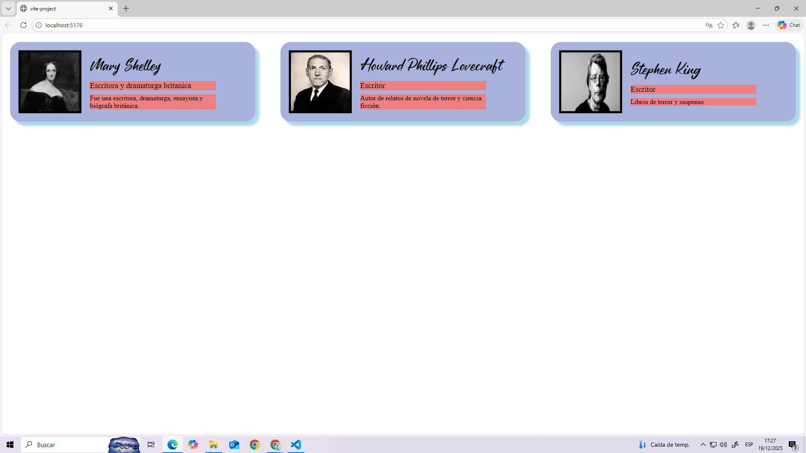
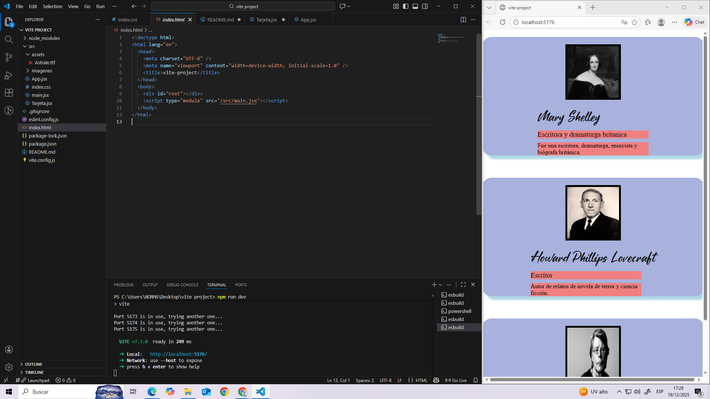

# React + Vite

# TAREA 4
Tarjetas renderizadas con Vite de diferentes escritores del terror, contienen una foto, nombre, profesion y datos.
● Creación de componentes funcionales.
● Uso de JSX.
● Paso de props para personalizar contenido.

## Estructura del Proyecto
- `index.html`  
- `index.css` → Estilos css. 
- `main.jsx` → root de la pagina.
- `Tarjeta.jsx` → Estructura de la tarjeta, componente funcional.
- `App.jsx` → Contenido de las diferentes tarjetas, props.

## Instrucciones para clonar el repositorio
1. Descargar o clonar el repositorio 
git clone https://github.com/andreacastillo2022-gif/tarea4.utn
2. ingresar a la carpeta
    cd tarea4-utn
3. Ejecutar la tarea: una vez en la terminal, ingresar npm install para que se instalen los componentes faltantes de Vite (node-modules) y luego npm run dev para que se cree la ruta de la pagina. Luego, ctrl + click para ingresar a ella.

## capturas de pantalla
Captura1: pagina completa con tarjetas en horizontal.
Captura2: pagina minimizada con tarjetas en vertical.

# Andrea Agustina Castillo
# Curso: Curso de Desarrollo en React JS
# Año: 2025

#Bibliografia
https://developer.mozilla.org/en-US/docs/Web/HTML/Element/img
https://react.dev/learn/writing-markup-with-jsx
https://react.dev/learn/passing-props-to-a-component
https://developer.mozilla.org/en-US/docs/Web/CSS/Reference/Properties/box-shadow
fuentes: https://www.dafont.com/es/astrale-couture.font
imagen stephen king: https://www.zagazine.mx/articulo/top-7-de-los-mejores-libros-de-stephen-king-que-no-puedes-dejar-de-leer
imagen h.p. lovecraft: https://es.wikipedia.org/wiki/H._P._Lovecraft
imagen de Mary Shelley: https://librosdelzorrorojo.com/autores/mary-shelley/
